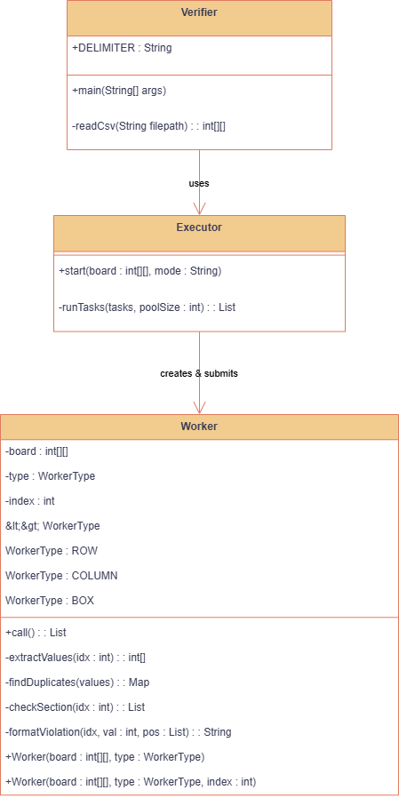
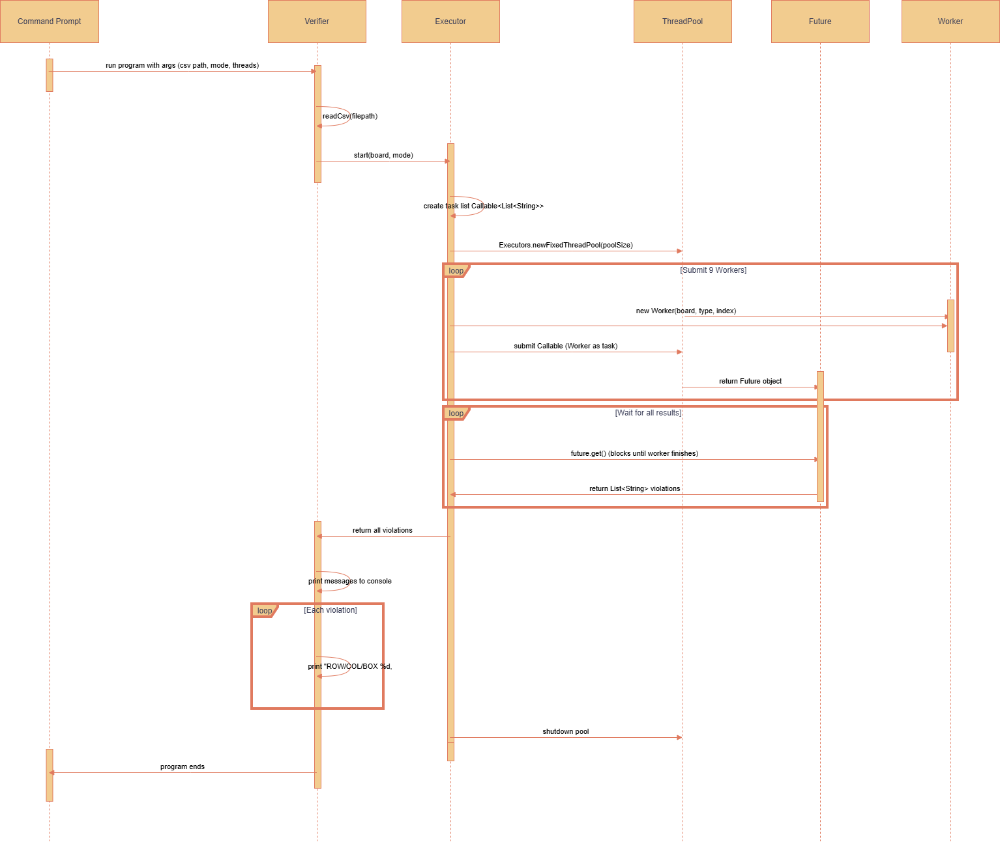

## Sudoku Verifier

### Table of Content

- [Assignment](#assignment)
- [Team Members](#team)
- [CMD](#run-in-cmd)
- [UML](#uml-diagrams)

### Run in CMD

After cloning this repository, you need to compile and build the application to allow running using the command line.

On opening in the editor, _preferably Intellji_, click on the **Maven** icon in the right hand side.
Click on **Lifecycle** folder, then right-click on the _clean_ command and select 
`Run 'sudoku[clean]'`.

After it is done, run `Run 'sudoku[package]'`.

This will produce a `target` folder in the repository directory, within it you will find a file `sudoku-1.0.jar`. 
That means it was successfully compiled into a JAR file.

Now you can run the application in the command line, after navigating to the repository directory ( or use **Terminal** in editor )
enter this command to run:

```bash
  java -jar target/sudoku-1.0.jar <csv_filepath> <mode>
```

- < csv_filepath > File path for CSV file with sudoku board.

- < mode > 0, 3, or 27

### UML Diagrams

#### Class diagram



#### Sequence diagram



### Assignment
The requirements requested by the TAs has be listed in this [pdf](https://drive.google.com/file/d/1ZWspc8yOz7P6kizod6806CFD2LAdXUkD/view?usp=drive_link).

Refer to it to check the completion of this project.


### Team
- [Andrew Sameh Adel Mikhail](https://github.com/acskii) - ID **9489**

    - Repository Owner & Merger
    - Thread Handling in Executor class
    - CSV Reading

- [Abdoalrahman Khedr](https://github.com/Abdoalrahmankhedr) - ID **9624**
    
    - Executor class w/ [Andrew Sameh Adel Mikhail](https://github.com/acskii)

- [Hassan Mohsen](https://github.com/Hassanmo-20) - ID **9635**

    - Class & Sequence diagrams

- [Ahmed Sherif](https://github.com/ahmed-sherif-hassona) - ID **9631**

  - Worker class